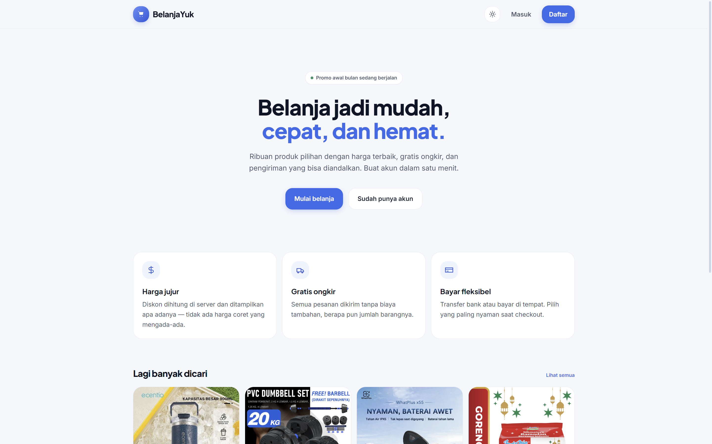
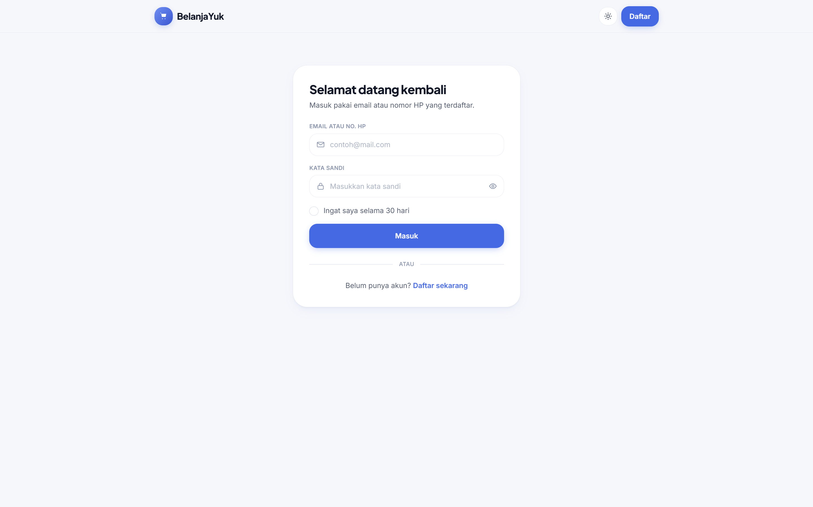
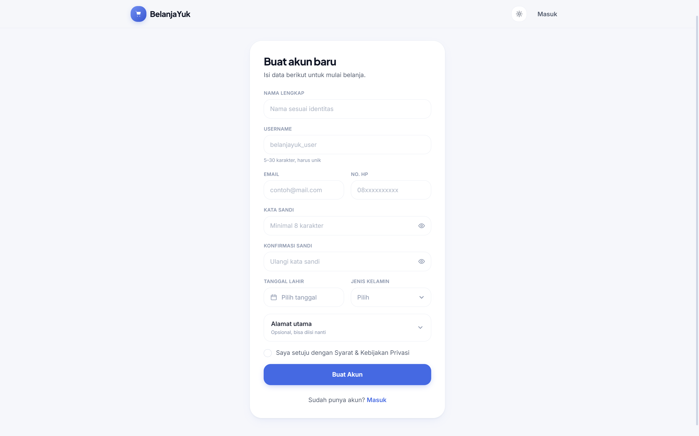
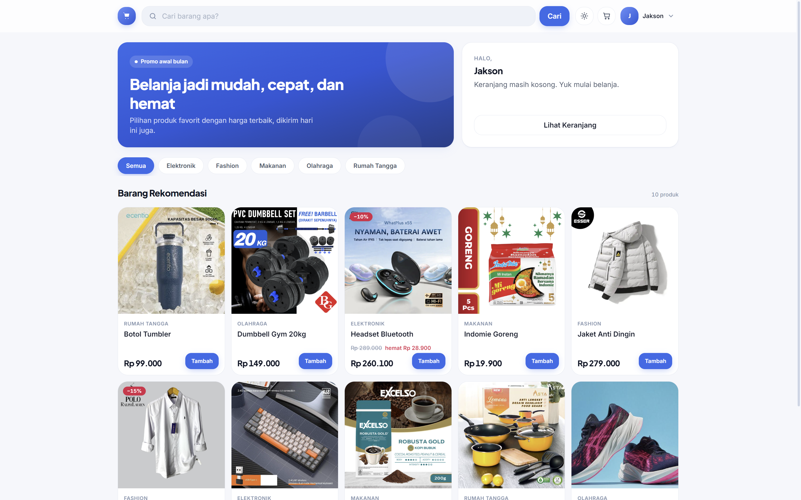
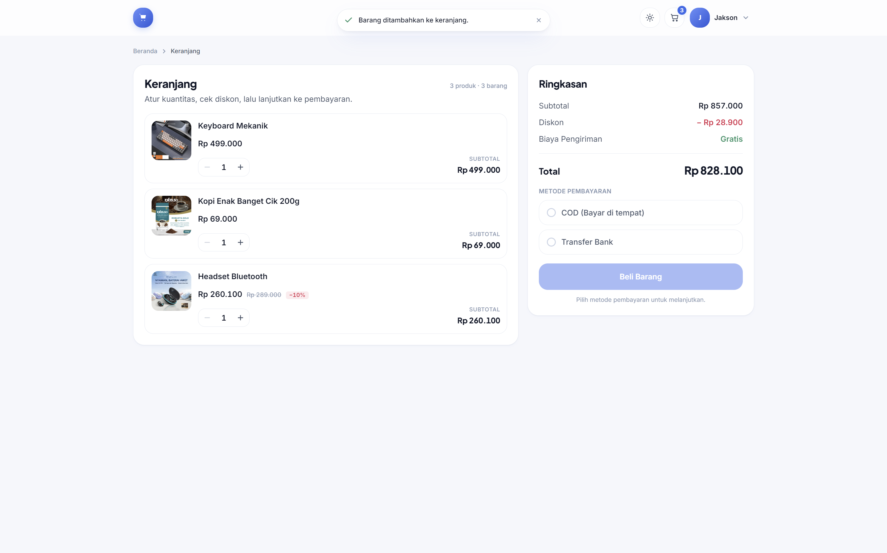
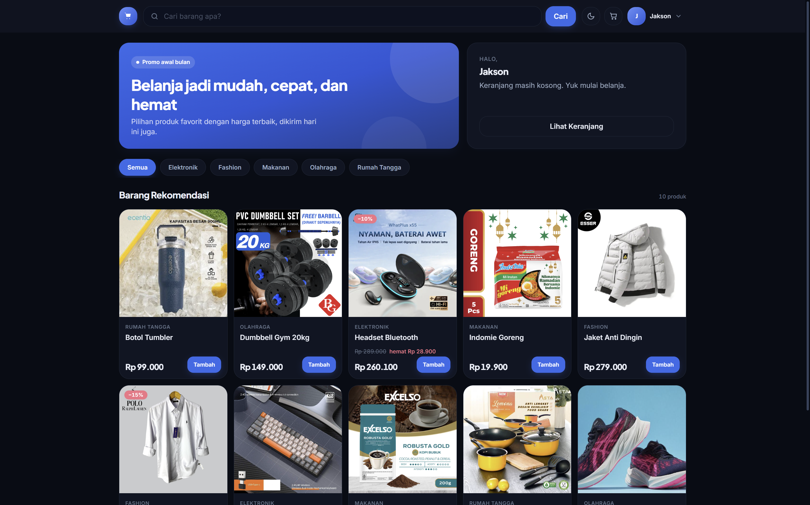
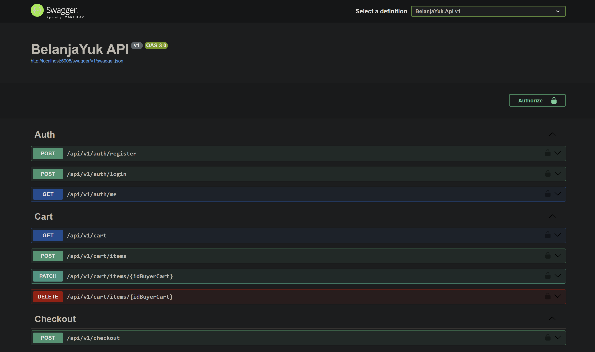

# BelanjaYuk

BelanjaYuk adalah aplikasi e-commerce dengan arsitektur terpisah antara Backend API (.NET 10, Clean Architecture) dan Frontend SPA (React + TypeScript). Seluruh business logic, kalkulasi harga, dan persistence berada di backend; frontend murni bertindak sebagai consumer melalui HTTP. Aplikasi mencakup registrasi & login dengan JWT, katalog produk dengan pencarian dan filter kategori, keranjang belanja dengan kalkulasi diskon, serta proses checkout yang atomik.



---

## Daftar Isi

- [Menjalankan Project](#menjalankan-project)
- [Tampilan Aplikasi](#tampilan-aplikasi)
- [Konfigurasi Environment](#konfigurasi-environment)
- [Struktur Project](#struktur-project)
- [Arsitektur Backend](#arsitektur-backend)
- [Database](#database)
- [Daftar Endpoint](#daftar-endpoint)
- [Keputusan Teknis](#keputusan-teknis)
- [Batasan yang Diketahui](#batasan-yang-diketahui)

---

## Menjalankan Project

### Yang dibutuhkan

Hanya **Docker Desktop**. Tidak perlu install .NET SDK, Node.js, atau SQL Server.

### Langkah-langkah

**1. Clone repository**

```bash
git clone https://github.com/Jaaakson/ecommerce-belanja-yuk.git
cd ecommerce-belanja-yuk
```

**2. Siapkan file environment**

```bash
cp .env.example .env
```

Windows PowerShell:

```powershell
Copy-Item .env.example .env
```

File `.env` sudah berisi nilai default yang siap pakai untuk development. Tidak perlu diubah.

**3. Jalankan**

```bash
docker compose up --build
```

Build pertama memakan waktu 3–5 menit karena mengunduh base image .NET, Node, dan SQL Server. Build berikutnya jauh lebih cepat.

Tunggu sampai muncul baris berikut di log:

```
belanjayuk-api  | Now listening on: http://[::]:8080
belanjayuk-api  | Application started.
```

**4. Buka aplikasi**

| Layanan        | URL                           |
| -------------- | ----------------------------- |
| Web (Frontend) | http://localhost:3000         |
| API Swagger    | http://localhost:5005/swagger |
| SQL Server     | `localhost,1433`            |

**5. Membuat akun**

Buka http://localhost:3000, klik **Daftar sekarang**, lalu isi form registrasi. Setelah berhasil, Anda otomatis masuk ke halaman beranda.

Contoh data yang bisa dipakai:

| Field        | Nilai                |
| ------------ | -------------------- |
| Nama Lengkap | Budi Santoso         |
| Username     | budi_santoso         |
| Email        | budi@belanjayuk.test |
| No. HP       | 081234567890         |
| Kata Sandi   | Password123          |

Login menerima **email maupun nomor HP** dengan password yang sama.

### Menghentikan aplikasi

```bash
docker compose down
```

Data tetap tersimpan di Docker volume. Untuk menghapus semuanya dan mulai dari awal:

```bash
docker compose down -v
```

### Verifikasi cepat

```bash
docker compose ps
```

Ketiga container harus berstatus `Up`, dan `belanjayuk-db` harus `(healthy)`.

Database otomatis dibuat, dimigrasikan, dan diisi seed data saat API pertama kali dijalankan. Tidak ada langkah manual.

---

## Tampilan Aplikasi

### Login



### Registrasi



### Beranda



### Keranjang & Checkout



### Mode Gelap



### Dokumentasi API



---

## Konfigurasi Environment

Semua konfigurasi runtime dibaca dari environment variable. File `.env` di root digunakan oleh Docker Compose.

| Variable              | Deskripsi                                                                                          | Default                 |
| --------------------- | -------------------------------------------------------------------------------------------------- | ----------------------- |
| `MSSQL_SA_PASSWORD` | Password SA SQL Server. Minimal 8 karakter dengan huruf besar, kecil, angka, dan simbol.           | `YourStrong@Passw0rd` |
| `JWT_SECRET`        | Kunci penandatanganan JWT. Wajib minimal 32 karakter karena HMAC-SHA256 membutuhkan kunci 256-bit. | disediakan              |

Variable yang di-inject Compose ke container API:

| Variable                                 | Keterangan                             |
| ---------------------------------------- | -------------------------------------- |
| `ConnectionStrings__DefaultConnection` | Connection string SQL Server           |
| `Jwt__Issuer`, `Jwt__Audience`       | Validasi issuer dan audience token     |
| `Jwt__ExpiryMinutes`                   | Masa berlaku token (default 120 menit) |
| `Cors__AllowedOrigins__0`              | Origin frontend yang diizinkan         |

Format `__` (double underscore) adalah konvensi .NET untuk nested configuration key, dan angka di akhir merepresentasikan indeks array.

`.env` tidak di-commit ke repository. Gunakan `.env.example` sebagai acuan.

### Menjalankan tanpa Docker

Jika ingin menjalankan secara lokal untuk pengembangan:

```bash
# Backend
cd api
dotnet run --project src/BelanjaYuk.Api

# Frontend (terminal terpisah)
cd web
npm install
npm run dev
```

Backend membaca konfigurasi dari `api/src/BelanjaYuk.Api/appsettings.Development.json`. Frontend membaca `web/.env` dan berjalan di port 5173. SQL Server tetap perlu tersedia di `localhost,1433`.

---

## Struktur Project

```
ecommerce-belanja-yuk/
├── api/                            Backend .NET 10
│   ├── src/
│   │   ├── BelanjaYuk.Domain/          Entity, base class, aturan harga
│   │   ├── BelanjaYuk.Application/     DTO, service, validator, interface
│   │   ├── BelanjaYuk.Infrastructure/  DbContext, EF config, migration, seed
│   │   └── BelanjaYuk.Api/             Controller, middleware, DI, konfigurasi
│   ├── Directory.Build.props           MSBuild properties terpusat
│   ├── Directory.Packages.props        Versi NuGet terpusat
│   ├── Dockerfile
│   └── BelanjaYuk.sln
│
├── web/                            Frontend React + TypeScript
│   ├── src/
│   │   ├── api/                        Axios client, tipe response, fungsi endpoint
│   │   ├── components/                 Provider dan komponen UI bersama
│   │   ├── features/                   Kode per fitur: auth, products, cart
│   │   ├── lib/                        Context dan hook
│   │   └── routes/                     Protected route
│   ├── nginx.conf
│   └── Dockerfile
│
├── database/
│   └── 01-schema.sql               Script schema idempotent (hasil generate EF)
│
├── docs/
│   ├── erd.png                     ERD acuan
│   └── screenshots/                Tangkapan layar aplikasi
│
├── docker-compose.yml
├── .env.example
└── README.md
```

### Kenapa dipisah `api/` dan `web/`

Docker Compose membangun setiap service dengan build context terpisah. Dengan pemisahan ini, `node_modules` tidak ikut terkirim ke Docker daemon saat membangun image backend, dan sebaliknya. Reviewer juga langsung mengetahui batas antara kedua aplikasi tanpa perlu membaca dokumentasi.

---

## Arsitektur Backend

Backend menggunakan layered architecture dengan empat project dan arah dependency yang dijaga ketat.

```
          Api
        ↙     ↘
Application  ←  Infrastructure
     ↓
  Domain
```

| Layer                    | Isi                                                          | Boleh bergantung pada          |
| ------------------------ | ------------------------------------------------------------ | ------------------------------ |
| **Domain**         | Entity sesuai ERD,`AuditableEntity`, `PricingCalculator` | tidak ada — nol NuGet package |
| **Application**    | DTO, service, validator, interface abstraksi                 | Domain                         |
| **Infrastructure** | `AppDbContext`, Fluent API, interceptor, BCrypt, JWT       | Application                    |
| **Api**            | Controller, middleware, filter, DI registration              | Application, Infrastructure    |

### Aturan yang dijaga

**Domain tidak memiliki satu pun NuGet package.** Ini adalah uji paling sederhana untuk memastikan arah dependency benar, dan bisa diverifikasi:

```bash
cd api
dotnet list src/BelanjaYuk.Domain package
# → No packages were found for this framework.
```

Konsekuensinya, entity tidak boleh memakai attribute EF Core seperti `[Key]` atau `[Table]`. Seluruh pemetaan dilakukan lewat Fluent API di Infrastructure, satu file konfigurasi per entity.

**Application bergantung pada `Microsoft.EntityFrameworkCore`, tetapi tidak pada provider database.** Abstraksi EF Core dibutuhkan untuk mendapatkan `IQueryable` dan komposabilitas LINQ. Provider `SqlServer` hanya ada di Infrastructure, sehingga Application tidak mengetahui database apa yang digunakan.

**Api mereferensi Infrastructure hanya untuk registrasi DI.** Secara compile-time referensi itu ada, tetapi hanya dipakai satu kali di `Program.cs` melalui `AddInfrastructure()`. Tidak ada tipe Infrastructure yang bocor ke controller.

### Komponen penting

**Audit interceptor** — ERD mewajibkan kolom `DateIn`, `UserIn`, `DateUp`, `UserUp`, dan `IsActive` di setiap tabel. Alih-alih mengisinya manual di setiap service, sebuah `SaveChangesInterceptor` mengisi kolom-kolom tersebut secara otomatis pada setiap penyimpanan. Nilai `UserIn` diambil dari claim JWT melalui `ICurrentUserService`, dengan fallback `"SYSTEM"` untuk operasi tanpa autentikasi seperti registrasi dan seeding.

Interceptor juga memblokir perubahan pada `DateIn` dan `UserIn` saat update, sehingga metadata pembuatan record tidak bisa tertimpa secara tidak sengaja.

**Global query filter untuk soft delete** — filter `IsActive` dipasang pada tabel `Ms*` dan `Tr*`, tetapi **tidak** pada tabel lookup `Lt*`. Ini keputusan yang disengaja: menonaktifkan sebuah kategori seharusnya berarti "kategori ini tidak lagi bisa dipilih", bukan "semua produk dalam kategori ini hilang". Jika filter dipasang di tabel lookup, EF akan menghasilkan INNER JOIN yang diam-diam menghilangkan baris tanpa error apa pun. Filter `IsActive` untuk lookup diterapkan secara eksplisit di `LookupService`.

**Exception handling terpusat** — satu middleware menerjemahkan exception aplikasi menjadi HTTP response, sehingga controller bebas dari blok `try/catch` dan bentuk error konsisten di seluruh endpoint.

| Exception                 | HTTP Status                         |
| ------------------------- | ----------------------------------- |
| `ValidationException`   | 400                                 |
| `UnauthorizedException` | 401                                 |
| `NotFoundException`     | 404                                 |
| `ConflictException`     | 409                                 |
| lainnya                   | 500 (dicatat ke log secara lengkap) |

**Validasi otomatis** — sebuah action filter global memindai argumen setiap action, mencari validator FluentValidation yang cocok di DI container, lalu menjalankannya. Menambahkan validator baru tidak memerlukan perubahan pada controller maupun registrasi DI.

**Bentuk response konsisten** — seluruh endpoint mengembalikan envelope yang sama:

```json
{
  "success": true,
  "message": "Berhasil.",
  "data": { }
}
```

Response error menambahkan field `errors` berisi pesan per field, sehingga frontend dapat menempelkan pesan ke input yang tepat:

```json
{
  "success": false,
  "message": "Satu atau lebih input tidak valid.",
  "errors": {
    "Password": ["Kata sandi minimal 8 karakter."]
  }
}
```

---

## Database

Schema mengikuti ERD yang diberikan, kolom per kolom, dengan konvensi penamaan `Lt` (lookup), `Ms` (master), dan `Tr` (transaction).

Migration dijalankan otomatis saat API pertama kali start, diikuti proses seeding yang bersifat idempotent — aman dijalankan berulang tanpa menduplikasi data.

### Seed data

| Tabel            | Isi                                                  |
| ---------------- | ---------------------------------------------------- |
| `LtGender`     | Laki-laki, Perempuan                                 |
| `LtCategory`   | Elektronik, Fashion, Rumah Tangga, Olahraga, Makanan |
| `LtPayment`    | Transfer Bank, COD (Bayar di tempat)                 |
| `MsUserSeller` | satu toko demo sebagai pemilik katalog               |
| `MsProduct`    | 10 produk, sebagian dengan diskon                    |

### Script SQL

`database/01-schema.sql` adalah script idempotent hasil generate dari EF migration. File ini merupakan artifact, bukan sumber kebenaran — sumber kebenaran tetap berada pada migration. Untuk membuat ulang setelah perubahan schema:

```bash
cd api
dotnet ef migrations script -i \
  -p src/BelanjaYuk.Infrastructure \
  -s src/BelanjaYuk.Api \
  -o ../database/01-schema.sql
```

### Deviasi dari ERD

Empat penyesuaian dilakukan secara sadar:

| Deviasi                                           | Alasan                                                                                                                                                             |
| ------------------------------------------------- | ------------------------------------------------------------------------------------------------------------------------------------------------------------------ |
| `Rating` dan `RatingComment` dibuat nullable  | Rating diisi setelah transaksi selesai, sedangkan baris transaksi dibuat saat checkout. Kolom NOT NULL akan memaksa penggunaan nilai dummy yang tidak bermakna.    |
| `Kota/Kabupaten` → `KotaKabupaten`           | Karakter`/` tidak valid sebagai identifier C#.                                                                                                                   |
| `ProductImage` menyimpan URL, bukan base64      | `NVARCHAR(MAX)` memungkinkan keduanya, tetapi base64 membuat response daftar produk membengkak hingga satuan megabyte dan menghilangkan kemampuan cache browser. |
| Property`Firstname` ditulis `FirstName` di C# | ERD sendiri tidak konsisten (`Firstname` vs `LastName`). Nama kolom database tetap dipetakan persis sesuai ERD melalui `HasColumnName`.                      |

### Observasi terhadap ERD

Beberapa hal yang tidak tersedia di ERD dan karenanya tidak diimplementasikan:

- Tidak ada foreign key dari `TrBuyerTransaction` ke `TrHomeAddress`, sehingga alamat pengiriman tidak tersimpan per transaksi.
- Tidak ada kolom untuk biaya pengiriman meskipun mockup menampilkannya. Sesuai spesifikasi, nilainya dikunci pada Rp 0 (gratis ongkir).
- Tidak ada kolom status transaksi (pending, paid, shipped).
- Kolom `Rating` terduplikasi di header dan detail transaksi.

ERD tidak diubah untuk mengakomodasi hal-hal di atas.

---

## Daftar Endpoint

Base URL: `http://localhost:5005/api/v1`

| Method     | Endpoint             | Auth | Keterangan                                      |
| ---------- | -------------------- | ---- | ----------------------------------------------- |
| `POST`   | `/auth/register`   | —   | Registrasi akun baru                            |
| `POST`   | `/auth/login`      | —   | Login dengan email atau nomor HP                |
| `GET`    | `/auth/me`         | ✓   | Mengembalikan ID user dari token                |
| `GET`    | `/products`        | —   | Daftar produk dengan search, filter, dan paging |
| `GET`    | `/products/{id}`   | —   | Detail produk                                   |
| `GET`    | `/categories`      | —   | Daftar kategori aktif                           |
| `GET`    | `/genders`         | —   | Pilihan jenis kelamin untuk form registrasi     |
| `GET`    | `/payments`        | —   | Metode pembayaran aktif                         |
| `GET`    | `/cart`            | ✓   | Isi keranjang beserta ringkasan harga           |
| `POST`   | `/cart/items`      | ✓   | Menambahkan produk ke keranjang                 |
| `PATCH`  | `/cart/items/{id}` | ✓   | Mengubah kuantitas                              |
| `DELETE` | `/cart/items/{id}` | ✓   | Menghapus item dari keranjang                   |
| `POST`   | `/checkout`        | ✓   | Membuat transaksi dari isi keranjang            |

Query parameter untuk `/products`:

| Parameter      | Tipe   | Keterangan                                                   |
| -------------- | ------ | ------------------------------------------------------------ |
| `search`     | string | Tidak boleh hanya spasi, tidak boleh mengandung`< > / { }` |
| `idCategory` | string | Filter berdasarkan kategori                                  |
| `page`       | int    | Minimal 1                                                    |
| `pageSize`   | int    | Antara 1 dan 50                                              |

Endpoint yang membutuhkan autentikasi memerlukan header:

```
Authorization: Bearer <token>
```

Di Swagger UI, gunakan tombol **Authorize** dan tempelkan token tanpa prefix `Bearer`.

---

## Keputusan Teknis

### Kalkulasi harga sepenuhnya di server

Client hanya mengirim `idProduct` dan `qty`. Seluruh angka — harga setelah diskon, subtotal per item, total diskon, dan total akhir — dihitung di backend. Jika server mempercayai harga yang dikirim client, siapa pun dapat memodifikasi request dan membeli barang dengan harga sembarang.

Rumus diskon berada di satu tempat, `Domain.PricingCalculator`, dan dipakai bersama oleh katalog, keranjang, serta checkout. Menyalin rumus ke tiga tempat akan berujung pada ketidaksesuaian angka yang sulit dilacak.

Kolom `DiscountProduct` menyimpan **persentase**, bukan nominal — konsisten dengan tipe `DECIMAL(18,0)` di ERD dan terverifikasi terhadap mockup (Rp 289.000 dengan diskon 10% menjadi Rp 260.100).

### Snapshot harga saat checkout

`TrBuyerTransactionDetail` menyimpan salinan `PriceProduct` dan `DiscountProduct` pada saat checkout, bukan melakukan join ke `MsProduct`. Harga produk dapat berubah kapan saja; tanpa snapshot, riwayat transaksi lama akan ikut berubah dan tidak lagi mencerminkan jumlah yang benar-benar dibayar.

Sebaliknya, keranjang **tidak** menyimpan harga. Jika penjual menurunkan harga, pembeli langsung melihat harga terbaru di keranjang.

### Checkout bersifat atomik

Header transaksi, detail transaksi, pengurangan stok, dan pengosongan keranjang ditulis dalam satu `SaveChangesAsync`. EF Core membungkusnya dalam satu transaksi database — seluruhnya berhasil atau seluruhnya dibatalkan.

### Kepemilikan data menjadi bagian dari query

Operasi pada keranjang tidak mencari item lalu memeriksa pemiliknya, melainkan menyertakan `IdUser` langsung di dalam predikat query. Dengan cara ini, permintaan terhadap item milik orang lain menghasilkan respons yang identik dengan item yang tidak ada, sehingga tidak membocorkan informasi tentang keberadaan data.

`IdUser` selalu diambil dari claim JWT, tidak pernah dari request body.

### Hashing password

BCrypt dengan work factor 12, bukan SHA-256. SHA-256 dirancang untuk cepat, dan kecepatan adalah kelemahan untuk hashing password — penyerang dapat mencoba miliaran kombinasi per detik menggunakan GPU. BCrypt dirancang untuk lambat, menyertakan salt secara otomatis, dan work factor-nya dapat dinaikkan seiring perkembangan hardware tanpa merusak hash lama.

`MsUserPassword` memiliki primary key terpisah dari `IdUser`, yang memungkinkan satu user memiliki riwayat lebih dari satu password. Query login karenanya mengambil password aktif terbaru, bukan sekadar baris pertama yang cocok.

### Validasi berlapis

Validasi uniqueness untuk username, email, dan nomor HP dilakukan di service untuk menghasilkan pesan error yang mudah dibaca. Namun jaminan sebenarnya berada pada unique index di database, karena dua request bersamaan dapat lolos pemeriksaan aplikasi. Prinsipnya: validasi aplikasi untuk pengalaman pengguna, constraint database untuk kebenaran data.

### Tanpa AutoMapper, MediatR, dan Repository pattern

`DbContext` sudah merupakan implementasi Unit of Work dan `DbSet<T>` sudah merupakan Repository. Membungkusnya kembali menghasilkan lapisan tambahan yang harus tumbuh setiap kali ada kebutuhan query baru, tanpa memberikan perlindungan nyata.

AutoMapper dan MediatR tidak digunakan karena perubahan lisensi pada 2025, dan karena mapping otomatis menyembunyikan kesalahan saat property di-rename — mapping manual bersifat type-safe dan diperiksa compiler.

### Manajemen dependency terpusat

`Directory.Build.props` menyimpan MSBuild property yang berlaku untuk seluruh project, dan `Directory.Packages.props` menyimpan versi seluruh NuGet package. Tanpa keduanya, upgrade framework berarti menyunting empat file dan version drift antar-project menjadi hanya soal waktu.

`EnforceCodeStyleInBuild` membuat aturan `.editorconfig` diperiksa saat build, bukan sekadar menjadi saran di IDE. File migration dikecualikan dari pemeriksaan ini karena merupakan kode hasil generate.

### Docker

Kedua image menggunakan multi-stage build, sehingga SDK .NET dan toolchain Node tidak ikut ke image runtime. Restore dependency dilakukan sebelum source code disalin, agar perubahan kode tidak membatalkan cache layer dependency.

Container API menunggu healthcheck SQL Server, bukan sekadar container start. Tanpa itu, API akan mencoba melakukan migrasi sebelum SQL Server siap menerima koneksi.

`VITE_API_BASE_URL` merupakan build argument, bukan environment variable runtime, karena Vite menyisipkan nilainya ke dalam bundle saat build. Nilainya menunjuk `localhost:5005` dan bukan hostname jaringan Docker, sebab bundle JavaScript berjalan di browser — di luar jaringan container.

Container API berjalan sebagai user non-root bawaan image .NET.

---

## Batasan yang Diketahui

Hal-hal berikut disadari sejak awal dan tidak diimplementasikan karena berada di luar scope atau memerlukan perubahan pada ERD.

**Race condition pada stok saat checkout bersamaan.** Dua pengguna yang melakukan checkout terhadap unit terakhir secara bersamaan dapat sama-sama lolos validasi, sehingga stok menjadi negatif. Dua solusi yang umum: *optimistic concurrency* dengan menambahkan kolom `rowversion` pada `MsProduct` sehingga EF Core dapat mendeteksi konflik, atau *pessimistic locking* menggunakan hint `UPDLOCK` saat membaca baris produk. Opsi pertama memerlukan kolom yang tidak ada di ERD; opsi kedua menurunkan throughput. Untuk scope assessment ini, keduanya tidak diterapkan.

**Pencarian menggunakan `LIKE '%keyword%'`.** Leading wildcard membuat index tidak dapat digunakan, sehingga performa menurun pada tabel berukuran besar. Solusi produksinya adalah full-text search.

**Token disimpan di localStorage.** Spesifikasi mensyaratkan fitur "ingat saya" selama 30 hari, yang membutuhkan penyimpanan persisten. Konsekuensinya, token dapat diakses oleh JavaScript dan karenanya rentan terhadap XSS. Alternatif yang lebih aman adalah httpOnly cookie dengan refresh token, tetapi pendekatan itu memerlukan penanganan CSRF tersendiri.

**Pesan error login membedakan "tidak terdaftar" dan "kata sandi salah".** Spesifikasi meminta kedua pesan tersebut secara eksplisit. Dari sisi keamanan, pesan generik lebih baik karena tidak memungkinkan penyerang memetakan email mana yang terdaftar. Spesifikasi diikuti, dengan catatan ini.

**Migration dijalankan saat startup aplikasi.** Praktik ini memudahkan reviewer menjalankan project dengan satu perintah. Pada deployment dengan banyak instance, migration sebaiknya dijalankan sebagai job terpisah.

**Belum ada automated test.** Struktur berlapis dengan interface abstraksi sudah menyiapkan jalan untuk unit test pada layer Application tanpa memerlukan database, tetapi test belum ditulis dalam scope ini.

**Primary key bertipe `NVARCHAR(36)`.** Mengikuti ERD. Secara teknis `UNIQUEIDENTIFIER` atau sequential GUID lebih efisien — `NVARCHAR(36)` membutuhkan 72 byte per key dan GUID acak menyebabkan page split pada clustered index. ERD tetap diikuti apa adanya.

---

## Teknologi

**Backend** — .NET 10 (LTS), ASP.NET Core Web API, Entity Framework Core 10, SQL Server 2022, FluentValidation, BCrypt.Net, JWT Bearer, Swashbuckle.

**Frontend** — React 19, TypeScript, Vite, React Router, Axios, Tailwind CSS 4.

**Infrastruktur** — Docker, Docker Compose, nginx.
